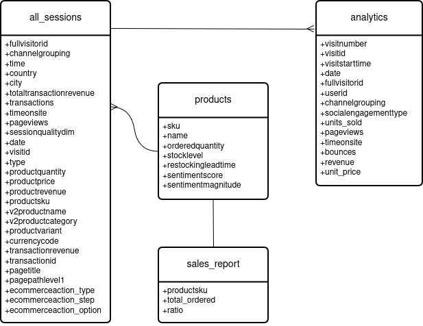

# Project: Transforming and Analyzing Data with SQL

## Project/Goals
I was given a dataset from an online shopping website that sells a large variety of products from many different categories. The dataset contained data pertaining to visitors, visits, and analytics collected per visit including that related to purchases. I used SQL to clean and analyze the data in an effort to extract insights concerning customers' spending habits, taking into account factors such as product preference, geographical location, and how customers made their way to the website. 

## Process

### 1. Create the Database and Load the Data

The website's dataset came in the form of five csv files, one per table of the database. I created the tables using postgreSQL with all column data types initially set to text to ease the process of importing the data. Once the data was loaded, I looked through each column to determine what would be the most appropriate data type. Then, I made the corresponding alterations to the database.

### 2. Clean the Data

In cleaning the data, I did make a few significant changes to the database. I deleted some records that contained invalid data (including some that contained foreign keys values that didn't match with any primary key value), dropped a number of redundant columns, and even managed to eliminate one table completely (sales_by_sku) as it contained no information that wasn't duplicated in other tables.

At the end of my data cleaning, I constructed a new ERD:

## Results

The main insights I gained from analyzing this dataset are:

- Business is slow outside of the United States.
- For meaningful comparisons, it is better for US cities to be analyzed alongside entire countries.
- How customers arrive at the website does seem to impact their decision to purchase. In particular, the exploratory analysis conducted here suggests that customers who arrived at the shopping website from a referral are more likely to buy something.
- Analyzing numbers (and average numbers) of products purchased may not be particularly useful given the wide range of products available. Comparing numbers of backpacks purchased to numbers of lip balm tins purchased doesn't seem useful. But perhaps some useful insights could be obtained by addressing these sorts of questions based on product categories, rather than aggregating all products together.     

## Challenges 

The main challenges I faced while working on this project were:

- indentifying primary and foreign keys within the tables of the database
- deciding what data to drop while data cleaning
- discerning the meaning of the data within many of the table columns.

## Future Goals

- There is still much that could be done in terms of cleaning the data. There's major issues remaining related to primary and foreign key identification (as noted above). There are also minor issues that could be dealt with including filling in more of the database's null values where possible, defining some new data types for particular columns, adding some uniformity to the format of various IDs, and trimming white space from around many text entries.  

- As noted above, some of the queries I performed suggested that there were underlying patterns in the data, but that further analysis would be needed to draw definitve conclusions.  

- I would like to refactor my code in an attempt to shorten some of my queries. In writing the queries for this project, I made liberal use of CTEs. Perhaps some of them could be replaced by subqueries. Also, there are likely places where I've repeated snippets of code. Perhaps these snippets could be encapsulated as functions.

- Once I'd cleaned the data to my satisfaction, I would like to add constraints and checks to many of the columns to prevent invalid data from being added in the future. Also, I would like to bundle together my scripts related to data quality assurance into something more automated and informative.

